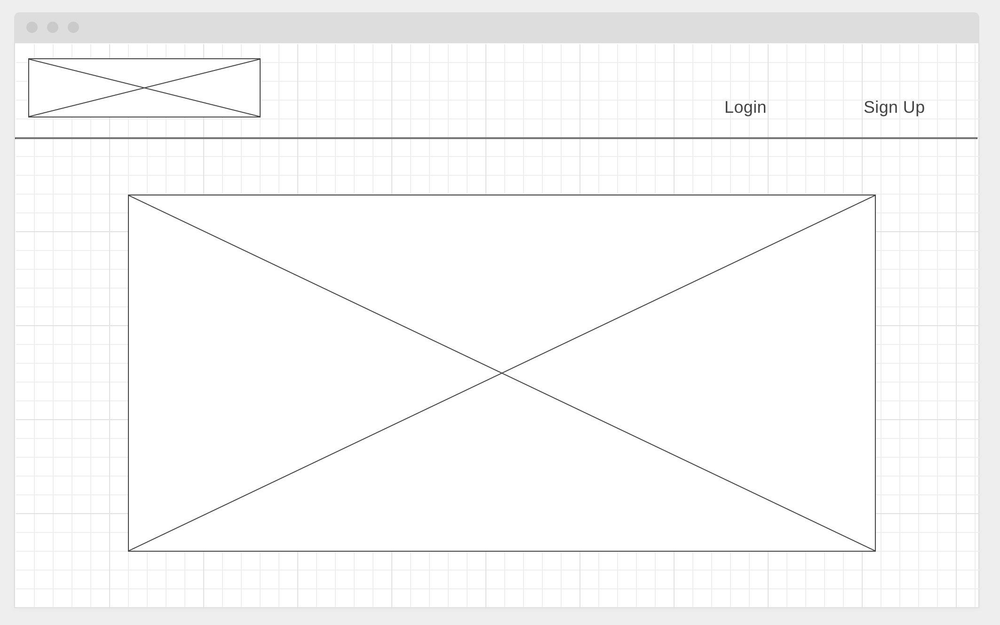
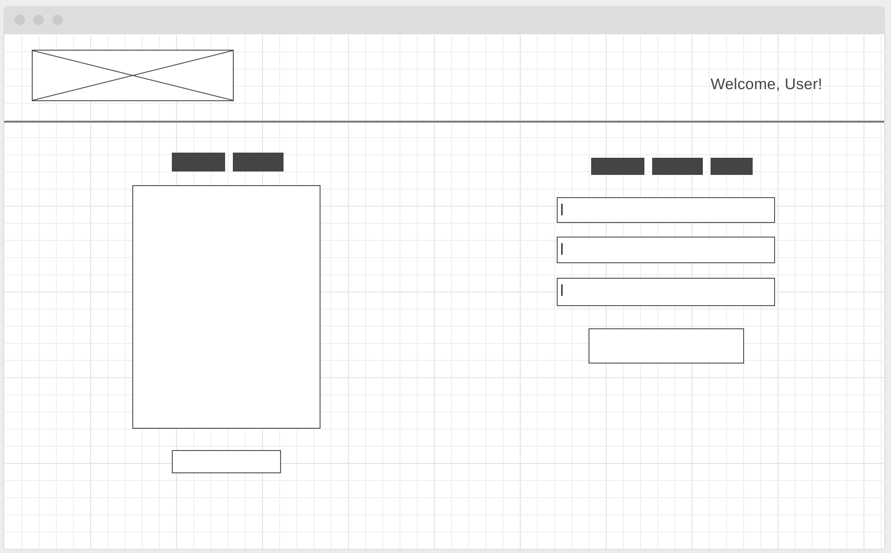
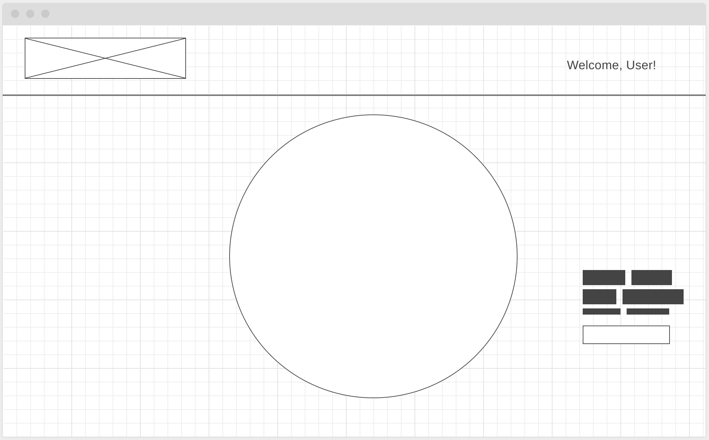
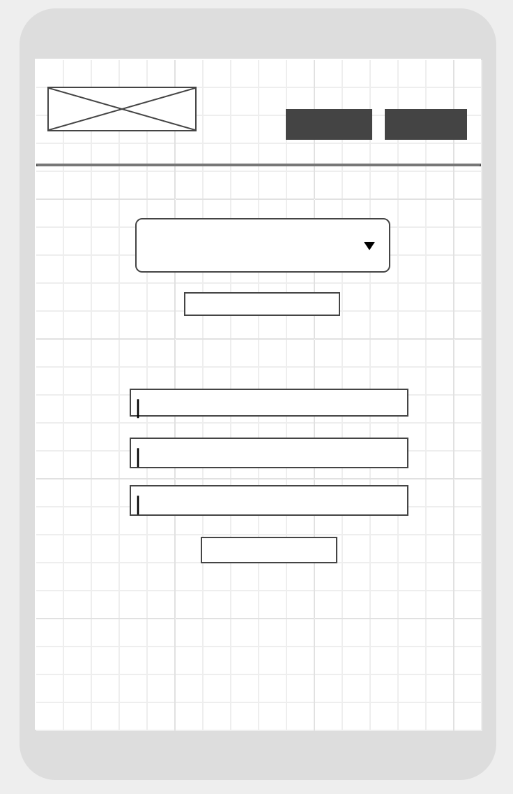
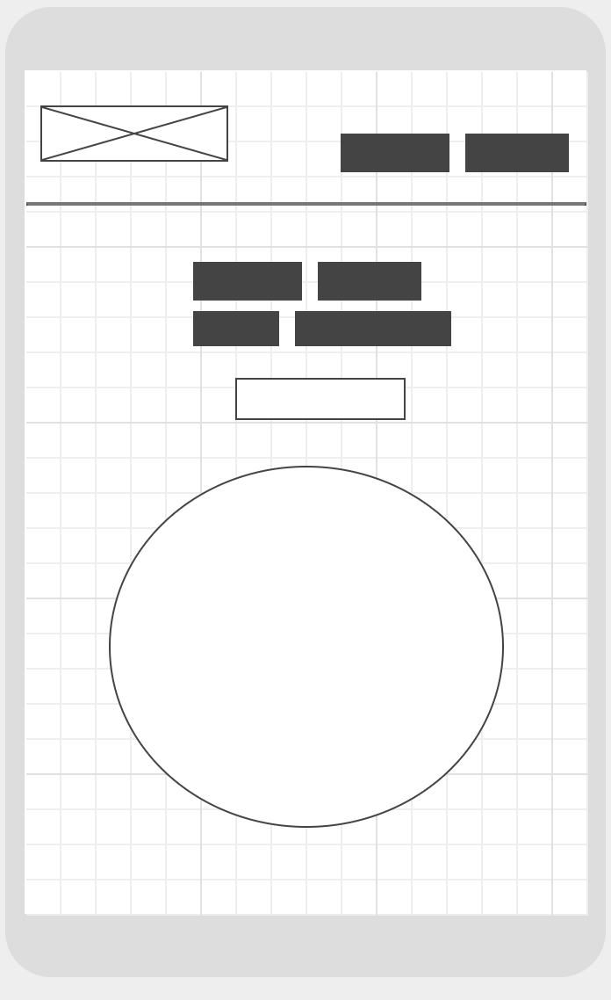
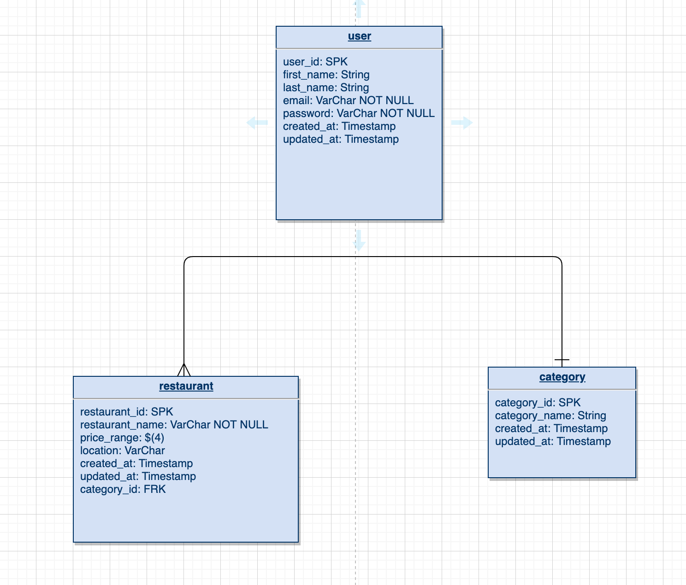

# Hangry Helper <!-- omit in toc -->


- [Overview](#Overview)
  - [Core Features](#Core-Features)
- [MVP](#MVP)
  - [Client (Front End)](#Client-Front-End)
    - [Wireframes](#Wireframes)
    - [Component Hierarchy](#Component-Hierarchy)
  - [Server (Back End)](#Server-Back-End)
    - [ERD Model](#ERD-Model)
    - [Data Heirarchy](#Data-Heirarchy)
  - [Dependencies](#Dependencies)
- [Post-MVP](#Post-MVP)


<br>

## Overview

_**Hangry Helper** is a web application that helps hangry people decide on what to eat. Help yourself avoid an argument by using this app to take the hard decisions off your hands._

### Core Features

- _Create personal user accounts._
- _Organize your favorite restaurants by categories._
- _Continue to grow your list of restaurants._
- _Generate a random choice from your list of favorites._

<br>

## MVP

_The **Hangry Helper** MVP will be a functional CRUD web application. Users will be able to create accounts using JWT authentication. The list of user's restaurants can be organized by categories. From the categories, specific details from a restaurant can be added by the user (name, location, price range). Using the list of restaurants, the user will be taken to page where a random place is generated._

### Client (Front End)

#### Wireframes




- Desktop Landing



- Desktop Add A Restaurant



- Desktop Randomizer



- Mobile Add A Restaurant



- Mobile Randomizer


#### Component Hierarchy

``` structure

src
|__ assets/
      |__ images
|__ components/
      |__ Header.jsx
      |__ Footer.jsx
      |__ Navigation.jsx
      |__ Landing.jsx
      |__ CreateRes.jsx
      |__ ViewCategories.jsx
      |__ GenerateRand.jsx
|__ services/
      |__ api-helper.js

```

<br>

### Server (Back End)

#### ERD Model



#### Data Heirarchy

``` structure

database_db
|__ users/
|__ categories/
|__ restaurants/

```

<br>

### Dependencies

|     Library      | Description                                |
| :--------------: | :----------------------------------------- |
|      React       | _This is used to build out the UI._        |  
|   Ruby on Rails   | _This is used to create the database._    |


<br> 

## Post-MVP

- Integrate the use of Yelp's API to allow users to search restaurants, see ratings, and reviews.
- Integrate Google Maps to allow users to see the location of the randomly generated restaurants.
